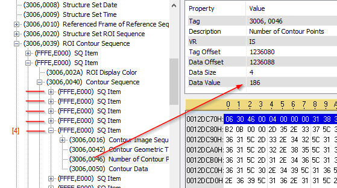

##Easy DICOM Selection
The DICOMSelector used to be a premium feature of the library and now it is included for free. It is all about convenience. Selecting and manipulating DICOM elements is easy with Evil DICOM, but it is even EASIER when you are using the selector. The selector gives you *strongly* typed access to all elements allowing you to do complex hierarchical descension by dot notation. You never have to manually cast the element with this module.

###Grabbing A Selector Object
To create a DICOM selector is easy!
```csharp
var dcm = DICOMFileReader.Read("structureSet.dcm");
var sel = dcm.GetSelector();
```

###Dot Descension
The following example shows the simple dot descension into an element of the DICOM object. The Selector is just a wrapper around the object that allows for quick access to the elements.
```csharp
//Select a single element and get data
var dcm = DICOMFileReader.Read("structureSet.dcm");
var sel = new DICOMSelector(dcm);

//The default way
var defaultModality = (dcm.FindFirst(TagHelper.MODALITY) as CodeString).Data;

//The SELECTION module way
var modality = sel.Modality.Data; //RTSTRUCT

Assert.AreEqual(modality, "RTSTRUCT");
```

###Selecting Mulitple Elements
Selecting multiple elements of the same type is really easy. Just add an underscore (_) after the name of the element.
```csharp
var dcm = DICOMFileReader.Read("structureSet.dcm");
var sel = new DICOMSelector(dcm);

//The default way
var defaultRoiNumbers = dcm.FindAll(new Tag[] { TagHelper.STRUCTURE_SET_ROISEQUENCE, TagHelper.ROINUMBER })
.Select(rn => rn as IntegerString).ToList();

//THE SELECTION module way
var roiNumbers = sel.StructureSetROISequence
				.Select(s => s.ROINumber_);

foreach (var roi in roiNumbers)
{
	Console.WriteLine(roi.Data);
}
Assert.AreEqual(roiNumbers.Count, 4);
```
###Deep Descension
The real payoff of using the module comes when you need to dig deep. The following show just how easy it is to drill deep into the DICOM object using the Selection object
```csharp
var dcm = DICOMObject.Read("structureSet.dcm");
var selector = dcm.GetSelector();
var numCtrPoints = selector.ROIContourSequence
                .Select(s => s.ContourSequence_[1])
                .Select(s => s.NumberOfContourPoints_[4]);
Assert.AreEqual(numCtrPoints.Data, 186);
```

###Quick Manipulation
It is also very easy to quickly modify DICOM data (for anonymization for example).

```csharp
var dcm = DICOMFileReader.Read(Resources.structure);
var sel = new DICOMSelector(dcm);

//Modify some data deep in the DICOM object
selector.ROIContourSequence
        .Select(s => s.ContourSequence_[1])
        .Select(s => s.NumberOfContourPoints_[4]).Data = 500;
DICOMFileWriter.WriteLittleEndian("structureMod.dcm", sel.ToDICOMObject());
dcm = DICOMFileReader.Read("structureMod.dcm");
selector = new DICOMSelector(dcm);
var numCtrPoints = selector.ROIContourSequence
                .Select(s => s.ContourSequence_[1])
                .Select(s => s.NumberOfContourPoints_[4]);
Assert.AreEqual(numCtrPoints.Data, 500);
```